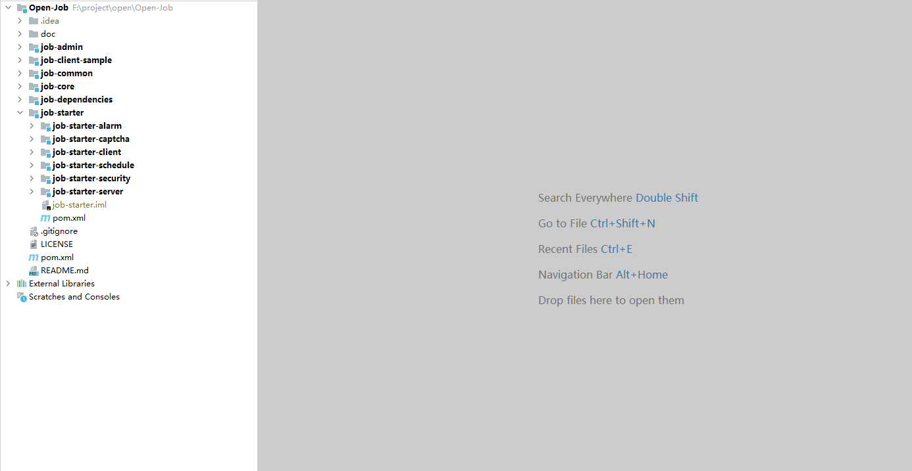

# Open-Job

## github 地址

https://github.com/lijunping365/Open-Job

## 项目模块说明



```
├──job-admin 任务后台管理系统，可进行添加、修改、删除任务，启动、停止任务，查看并监控任务执行情况。
├──job-client-sample 任务执行模块示例工程，支持集群部署
    ├──job-client1
    ├──job-client2
    ├──job-client3
├──job-common 整个项目用到的公共模块，包括一些工具包，常量等
├──job-core Grpc 通信核心模块，里面定义了通信协议
├──job-dependencies 项目 maven 依赖
├──job-starter 包含了一些自研插件，不仅可以在本项目中可以使用，而且也可以用在其他项目中的插件
    ├──job-starter-alarm 报警功能，默认提供钉钉报警通知，支持拓展其他报警能力
    ├──job-starter-captcha 支持多种验证码的生成，储存，校验（包括图片验证码，短信验证码，二维码）
    ├──job-starter-client 任务执行器，支持集群部署，拥有多种注册到服务端的方式
    ├──job-starter-schedule 基于 redis 的定时任务，轻量级，易拓展
    ├──job-starter-security 支持多种登录方式，支持生成验证 token，并支持多种 token 生成存储策略
    ├──job-starter-server 任务分发器，发现执行器并调用执行器进行任务分发
```


